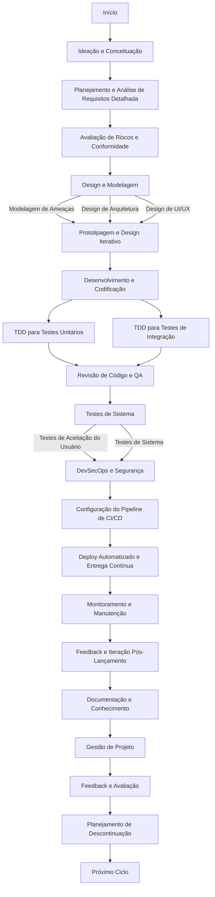
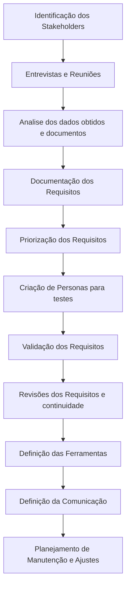

# Processo de Desenvolvimento de Software

Este documento descreve o processo de desenvolvimento de software adotado pela nossa equipe, incorporando práticas de DevSecOps e TDD (Test-Driven Development).

## Visão Geral do Processo

O processo de desenvolvimento segue um ciclo iterativo e abrangente, que começa desde a ideação até o lançamento e manutenção do software.

## Fases do Processo

### 1. Ideação e Conceituação
Nesta fase inicial, ideias são geradas e conceitos preliminares são explorados. É um momento crucial para entender as necessidades do projeto e definir objetivos claros.

Nese passo é fundamental idenficar as necessidades e problemas que o software atende
- Identificar o problema ou necessidade que o software pretende resolver, isto pode ter vindo de feedback de usuario, analise de mercado, inovações tecnolócias ou necessidades internas da organização.
- Realizar uma pesquisa de mercado ou na companhia para entender as necessidades dos usuários e identificar as lacunas nos produtos existentes, incluindo analise de concorrentes, tendencias de mercado e potencial mercado.

Também é importante ter neste momento um tempo para geração de ideias e pode ser feito de algumas formas:
- Realizando sessões de brainstorming com a equipe e stakeholders. Podem ser incruídos usuários se for possível gerando uma ampla variedade de ideias, mesmo que não sejam utilizadas, sem julgamentos ou críticas, apenas colocando à mesa.
- Realizar workshops com stakeholders e usuários para co-criar e/ou refinar as ideias. O objetivo é garantir que as necessidades dos usuários estejam no centro  do processo de desenvolvimento.   

Analisar e Selecionar as ideias é o passo onde definiremos o que fará parte do software, fazemos isto com 3 passos
- Analisando a viabilidade tecnica, financeira e operacional de cada ideia. Isto inclui considerações sobre tecnologia, custo, recursos necessários e tempo de desenvolvimento.
- Priorizando as ideias com base em critérios como valor para o usuário, alinhamento com objetivos de negócios, inovação e diferenciação competitiva.
- Escolhendo as ideias mais promissoras para desenvolver mais detalhadamente. Em alguns casos, pode ser útil criar protótipos rápidos ou conceitos para testar a viabilidade.

Defir o conceito da aplicação:
- Transformar a ideia selecionada em um conceito claro. Isso deve incluir a definição de funcionalidades chave, público-alvo, objetivos do software e como ele se diferencia de produtos existentes.
- Criar storyboards ou wireframes para visualizar o conceito do software. Isso ajuda a entender o fluxo do usuário e as funcionalidades principais.

### 2. Planejamento e Análise de Requisitos Detalhada
Envolve a coleta e análise detalhada dos requisitos dos stakeholders. Os requisitos funcionais e não funcionais são documentados para formar a base do projeto.

Um fluxo de analise de requisitos modelo pode ser seguinda

### 3. Avaliação de Riscos e Conformidade
Antes de prosseguir para o design e desenvolvimento, realizamos uma avaliação de riscos e verificamos a conformidade com regulamentações relevantes.

### 4. Design e Modelagem
Inclui a modelagem de ameaças, design de arquitetura e design de UI/UX. Esta fase define como o sistema será estruturado e como a interface com o usuário será.

### 5. Desenvolvimento e Codificação
Onde a codificação do software acontece. Aplicamos a metodologia TDD para garantir que o código seja robusto e testável desde o início.

#### TDD para Testes Unitários
Testes unitários são escritos antes do código para validar cada parte isoladamente.

#### TDD para Testes de Integração
Testes de integração são usados para garantir que diferentes módulos ou serviços funcionem bem em conjunto.

### 6. Revisão de Código e QA
Após o desenvolvimento, o código é revisado e passa por um rigoroso processo de garantia de qualidade.

### 7. Testes de Sistema
Realizamos testes de sistema abrangentes para verificar o comportamento e desempenho do sistema como um todo.

### 8. DevSecOps e Segurança
Integramos práticas de segurança em todas as fases do desenvolvimento, garantindo a segurança do sistema desde o início.

### 9. Configuração do Pipeline de CI/CD
Estabelecemos e configuramos o pipeline de integração e entrega contínua para automatizar o processo de lançamento.

### 10. Deploy Automatizado e Entrega Contínua
Automatizamos o deploy das aplicações nos ambientes de produção ou staging, visando rapidez e confiabilidade.

### 11. Monitoramento e Manutenção
Monitoramos o sistema em produção para garantir a sua saúde e desempenho, fazendo manutenções conforme necessário.

### 12. Feedback e Iteração Pós-Lançamento
Coletamos feedback dos usuários e iteramos o produto para melhorias contínuas.

### 13. Documentação e Conhecimento
Mantemos a documentação atualizada e compartilhamos conhecimento dentro da equipe.

### 14. Gestão de Projeto
Gerenciamos o projeto utilizando metodologias ágeis, adaptando-nos às mudanças e garantindo a entrega eficiente.

### 15. Feedback e Avaliação
Avaliamos o projeto regularmente para identificar áreas de melhoria e adaptar estratégias.

### 16. Planejamento de Descontinuação
Para projetos de longa duração, planejamos com antecedência a descontinuação do software.

### 17. Próximo Ciclo
Após a conclusão de um ciclo, o processo recomeça, incorporando os aprendizados e melhorias.

## Conclusão

Este processo de desenvolvimento é projetado para ser flexível e adaptável, garantindo que possamos responder efetivamente às mudanças de requisitos e desafios ao longo do projeto.
