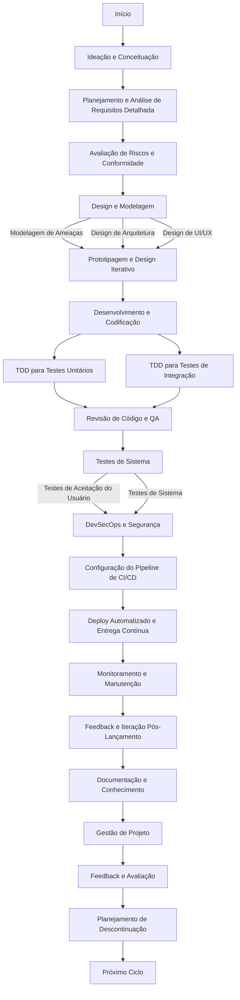
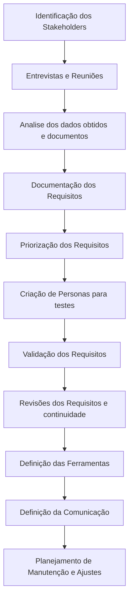

# Processo de Desenvolvimento de Software

Este documento descreve o processo de desenvolvimento de software adotado pela nossa equipe, incorporando práticas de DevSecOps e TDD (Test-Driven Development).

## Visão Geral do Processo

O processo de desenvolvimento segue um ciclo iterativo e abrangente, que começa desde a ideação até o lançamento e manutenção do software.



## Fases do Processo

### 1. Ideação e Conceituação
Nesta fase inicial, ideias são geradas e conceitos preliminares são explorados. É um momento crucial para entender as necessidades do projeto e definir objetivos claros.

Neste passo, é fundamental identificar as necessidades e problemas que o software atende:
- Identificar o problema ou necessidade que o software pretende resolver, o que pode ter vindo de feedback de usuário, análise de mercado, inovações tecnológicas ou necessidades internas da organização.
- Realizar uma pesquisa de mercado ou na companhia para entender as necessidades dos usuários e identificar as lacunas nos produtos existentes, incluindo análise de concorrentes, tendências de mercado e potencial de mercado.

Também é importante, neste momento, reservar um tempo para a geração de ideias, que pode ser feito de algumas formas:
- Realizando sessões de brainstorming com a equipe e stakeholders. Podem ser incluídos usuários, se possível, gerando uma ampla variedade de ideias, mesmo que não sejam utilizadas, sem julgamentos ou críticas, apenas colocando à mesa.
- Realizar workshops com stakeholders e usuários para co-criar e/ou refinar as ideias. O objetivo é garantir que as necessidades dos usuários estejam no centro do processo de desenvolvimento.   

Analisar e Selecionar as ideias é o passo onde definiremos o que fará parte do software, fazemos isto com 3 passos:
- Analisando a viabilidade técnica, financeira e operacional de cada ideia. Isto inclui considerações sobre tecnologia, custo, recursos necessários e tempo de desenvolvimento.
- Priorizando as ideias com base em critérios como valor para o usuário, alinhamento com objetivos de negócios, inovação e diferenciação competitiva.
- Escolhendo as ideias mais promissoras para desenvolver mais detalhadamente. Em alguns casos, pode ser útil criar protótipos rápidos ou conceitos para testar a viabilidade.

Definir o conceito da aplicação:
- Transformar a ideia selecionada em um conceito claro. Isso deve incluir a definição de funcionalidades chave, público-alvo, objetivos do software e como ele se diferencia de produtos existentes.
- Criar storyboards ou wireframes para visualizar o conceito do software. Isso ajuda a entender o fluxo do usuário e as funcionalidades principais.


### 2. Planejamento e Análise de Requisitos Detalhada
Envolve a coleta e análise detalhada dos requisitos dos stakeholders. Os requisitos funcionais e não funcionais são documentados para formar a base do projeto.

Um fluxo de analise de requisitos modelo pode ser seguinda



- Identificação dos Stakeholders: Identifique todas as partes interessadas no projeto, incluindo usuários finais, gerentes, equipe de TI e outras partes que possam influenciar ou ser afetadas pelo projeto, tanto positiva quanto negativamente.

- Entrevistas e Reuniões: Conduza entrevistas e reuniões com os stakeholders para entender suas necessidades e expectativas. Faça perguntas abertas para obter informações detalhadas.

- Análise dos Dados Obtidos e Documentos: Utilize diversas técnicas de elicitação de requisitos, como os dados obtidos nos passos anteriores, análise de documentos existentes, observação, questionários e workshops.

- Documentação dos Requisitos: Registre todos os requisitos coletados. Isso pode incluir requisitos funcionais (o que o software deve fazer), requisitos não funcionais (como desempenho, segurança, usabilidade) e restrições.

- Priorização dos Requisitos: Nem todos os requisitos têm a mesma importância. Trabalhe com os stakeholders para priorizar os requisitos, identificando o que é essencial, desejável ou opcional.

- Criação de Personas para Testes: Desenvolva personas para representar os diferentes tipos de usuários. Isso ajuda a entender melhor como eles interagem com o software e quais funcionalidades são mais importantes para eles.

- Validação dos Requisitos: Apresente os requisitos documentados aos stakeholders para garantir que todos os requisitos importantes foram capturados e estão corretos.

- Revisões dos Requisitos e Continuidade: Os requisitos podem mudar ao longo do tempo devido a mudanças nas necessidades dos negócios ou do mercado. Portanto, é importante revisar e atualizar os requisitos regularmente.

- Definição das Ferramentas: Defina as ferramentas adequadas, tanto para gerenciamento de requisitos como para manter o projeto.

- Definição da Comunicação: Garanta que haja uma comunicação efetiva e contínua entre a equipe de desenvolvimento e os stakeholders para evitar mal-entendidos e garantir que o produto final atenda às expectativas. Defina quem é responsável por cada informação, garanta que seja documentada em local organizado e defina o ChatOps para alertas e comunicação.

- Planejamento de Manutenção e Ajustes: Esteja preparado para fazer ajustes conforme necessário, pois novos requisitos podem surgir e outros podem se tornar obsoletos.


### 3. Avaliação de Riscos e Conformidade
Antes de prosseguir para o design e desenvolvimento, realizamos uma avaliação de riscos e verificamos a conformidade com regulamentações relevantes.4

Para garantir que todos os aspectos críticos sejam considerados e gerenciados de forma eficaz os passos abaixo são recomendados:
 
 ```mermaid
 flowchart TD
    A[Identificação de Requisitos de Conformidade] --> B[Avaliação de Riscos]
    B --> C[Análise de Impacto nos Negócios]
    C --> D[Desenvolvimento de Estratégias de Mitigação]
    D --> E[Implementação e Monitoramento]
    E --> F[Auditoria e Avaliação]
    F --> G[Documentação e Relatórios]
 ```

*Identificação de Requisitos de Conformidade:*
- Levantamento de Normas e Leis Aplicáveis: Identifique todas as normas, leis e regulamentações relevantes para o projeto, incluindo ISO Familia 27000, NIST, SOX, LGPD, GDPR, entre outras.

- Documentação de Requisitos Específicos: Liste os requisitos específicos de cada norma ou lei aplicável ao contexto do projeto.

*Avaliação de Riscos*
- Identificação de Ativos: Identifique todos os ativos que serão afetados pelo projeto (dados, sistemas, processos).

- Análise de Vulnerabilidades: Avalie os ativos para identificar vulnerabilidades potenciais ou existentes.

- Avaliação de Ameaças: Identifique ameaças que podem explorar essas vulnerabilidades.

- Determinação do Impacto: Avalie o impacto potencial de cada ameaça identificada.

*Análise de Impacto nos Negócios*
- Avaliação do Impacto Financeiro: Estime o impacto financeiro em caso de não conformidade ou falhas de segurança.

- Impacto na Reputação: Considere o impacto na reputação da empresa em casos de violação de dados ou não conformidade.

*Desenvolvimento de Estratégias de Mitigação*
- Definição de Controles: Estabeleça controles de segurança apropriados para mitigar riscos identificados.

- Plano de Resposta a Incidentes: Desenvolva um plano para responder a incidentes de segurança.

*Implementação e Monitoramento*
- Implementação de Controles: Implemente os controles de segurança.

- Monitoramento Contínuo: Monitore regularmente durante todo o projeto a eficácia dos controles e a aderência às normas.

*Auditoria e Avaliação*
- Auditorias Regulares: Realize auditorias periódicas durante todo o projeto para verificar a conformidade com as normas.

- Avaliação Contínua: Avalie continuamente os riscos e atualize as estratégias de mitigação conforme necessário.

*Documentação e Relatórios*
- Documentação Detalhada: Mantenha uma documentação completa das análises de risco, estratégias de mitigação e registros de auditorias.

- Relatórios para Stakeholders: Prepare relatórios regulares para stakeholders sobre o status da conformidade e gestão de riscos.

### 4. Design e Modelagem
Inclui a modelagem de ameaças, design de arquitetura e design de UI/UX. Esta fase define como o sistema será estruturado e como a interface com o usuário será.

### 5. Desenvolvimento e Codificação
Onde a codificação do software acontece. Aplicamos a metodologia TDD para garantir que o código seja robusto e testável desde o início.

#### TDD para Testes Unitários
Testes unitários são escritos antes do código para validar cada parte isoladamente.

#### TDD para Testes de Integração
Testes de integração são usados para garantir que diferentes módulos ou serviços funcionem bem em conjunto.

### 6. Revisão de Código e QA
Após o desenvolvimento, o código é revisado e passa por um rigoroso processo de garantia de qualidade.

### 7. Testes de Sistema
Realizamos testes de sistema abrangentes para verificar o comportamento e desempenho do sistema como um todo.

### 8. DevSecOps e Segurança
Integramos práticas de segurança em todas as fases do desenvolvimento, garantindo a segurança do sistema desde o início.

### 9. Configuração do Pipeline de CI/CD
Estabelecemos e configuramos o pipeline de integração e entrega contínua para automatizar o processo de lançamento.

### 10. Deploy Automatizado e Entrega Contínua
Automatizamos o deploy das aplicações nos ambientes de produção ou staging, visando rapidez e confiabilidade.

### 11. Monitoramento e Manutenção
Monitoramos o sistema em produção para garantir a sua saúde e desempenho, fazendo manutenções conforme necessário.

### 12. Feedback e Iteração Pós-Lançamento
Coletamos feedback dos usuários e iteramos o produto para melhorias contínuas.

### 13. Documentação e Conhecimento
Mantemos a documentação atualizada e compartilhamos conhecimento dentro da equipe.

### 14. Gestão de Projeto
Gerenciamos o projeto utilizando metodologias ágeis, adaptando-nos às mudanças e garantindo a entrega eficiente.

### 15. Feedback e Avaliação
Avaliamos o projeto regularmente para identificar áreas de melhoria e adaptar estratégias.

### 16. Planejamento de Descontinuação
Para projetos de longa duração, planejamos com antecedência a descontinuação do software.

### 17. Próximo Ciclo
Após a conclusão de um ciclo, o processo recomeça, incorporando os aprendizados e melhorias.

## Conclusão

Este processo de desenvolvimento é projetado para ser flexível e adaptável, garantindo que possamos responder efetivamente às mudanças de requisitos e desafios ao longo do projeto.
